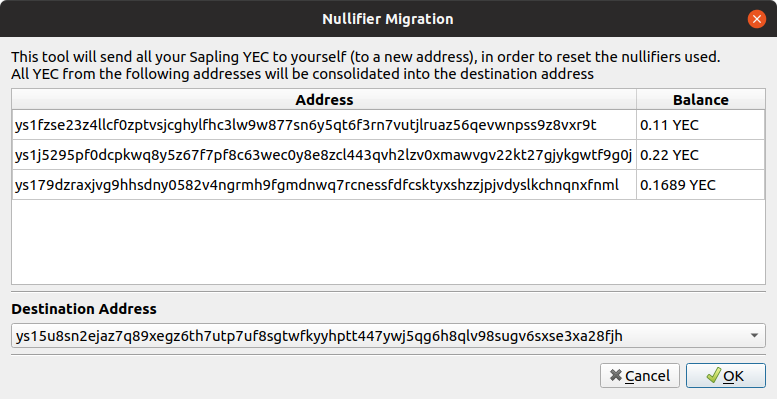

## Nullifier Migration
When Ycash forked from the Zcash blockchain at block height 570000, the sapling pool was also forked into Ycash and Zcash. Ycash and Zcash addresses shared the same private key and the same balance at the fork block. 

This also meant that the nullifiers used for the sapling addresses on both chains are shared. This created a possibility that when spending Zcash and the corresponding Ycash from the same address, a 3rd-party could potentially link those two addresses together by identifying that the same nullifier was used in these transactions. 

Note that the nullifier doesn't contain any personal data (no address, no balance, no other information), so it's not clear what will be gained by an attacker even if they manage to link the two nullifiers across the Ycash and Zcash chains. 

More Information - [Link 1](https://github.com/zcash/zcash/issues/4007) [Link 2](https://github.com/ycashfoundation/ycash/issues/11)

In any case, just to be on the cautious side, you should send all your Ycash sapling funds to yourself before you send them to an external party, so that the nullifiers used get reset. You can do this manually, but in Ycash 2.0.6, a new tool has been added to make this easier for you. 

#### Using the nullifier migration tool 
Go to `Apps -> Nullifier Migration` in YecWallet to get to the tool. 

This is a very simple tool that basically sends all your sapling YEC to yourself. The tool will display a list of all your sapling addresses and their YEC balances, and let you pick a destination sapling address from your wallet to send all your funds to. 

The funds are sent immedaitely, so you can start sending the sapling YEC to external addresses right after the transaction is confirmed. 
