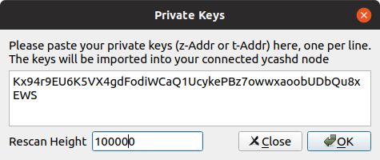
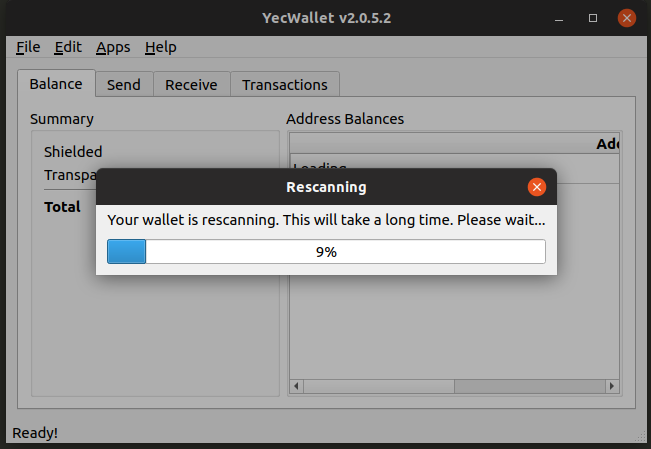

## Importing Private Keys into Ycash

Importing private keys, both transparent and shielded, is easier than ever. From the RPC, you can use `importprivkey` for transparent addresses and `z_importkey` for shielded addresses. 

#### `startHeight`
When you import a new private key into Ycash, ycashd needs to rescan the blockchain from the genisis block to check for transactions that belong to the key. This process is called "rescanning" and can sometimes take hours. 

However, you can speed up the rescan if you, for example, are confident that there are no transactions for a private key before block 400000, you can specify block 400000 as the `startHeight` parameter, significantly speeding up the rescan. 

Both RPC calls accept an optional `startHeight` parameter that specifies from what block height to start scanning for transactions. 

#### Checking on the rescan status
Ycash 2.0.6 adds a new RPC call `getrescaninfo` that will return the current status and progress of the rescan, if one is in progress. You can use this RPC call to keep tabs on how the import key is proceeding. 

## YecWallet
Both the `startHeight` and the rescan progress can be tracked from YecWallet. When you import a private key in YecWallet, you can specify the optional `startHeight` parameter. 

After the key import has started, you will also see a progress dialog showing the progress of the import.

